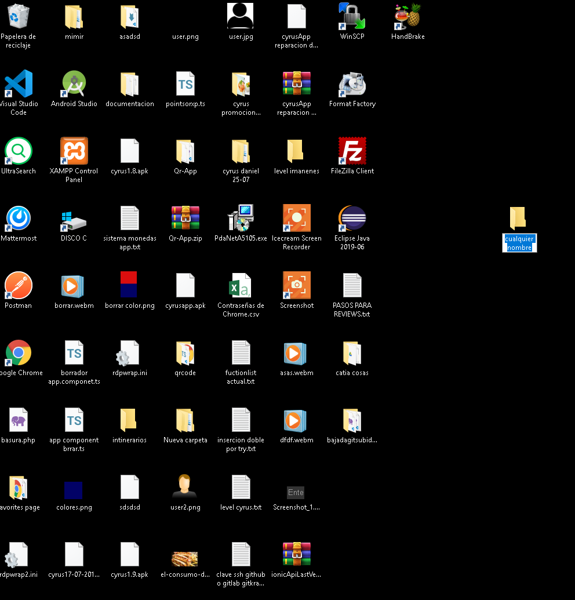
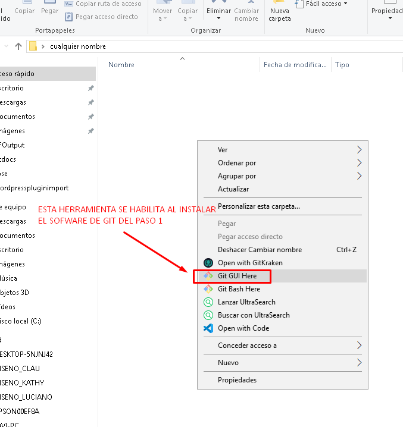
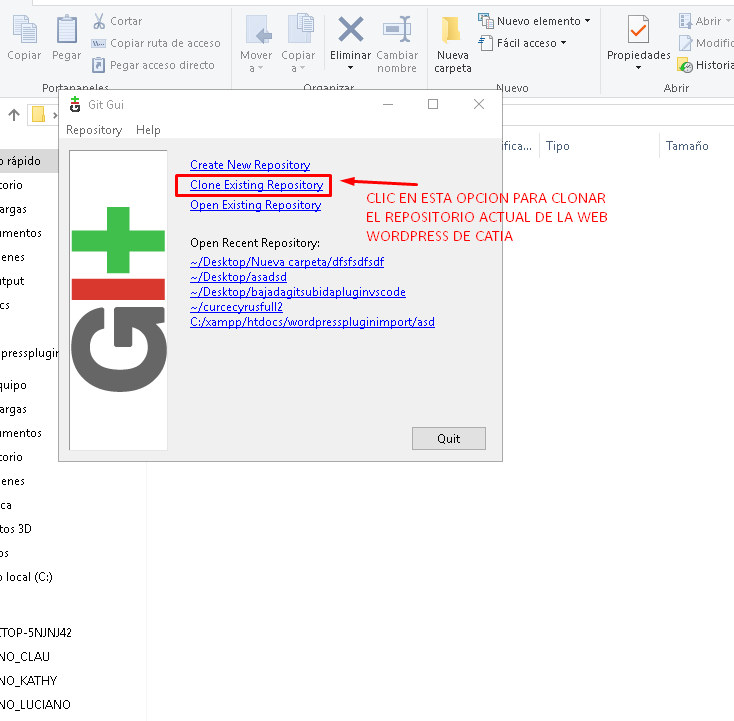
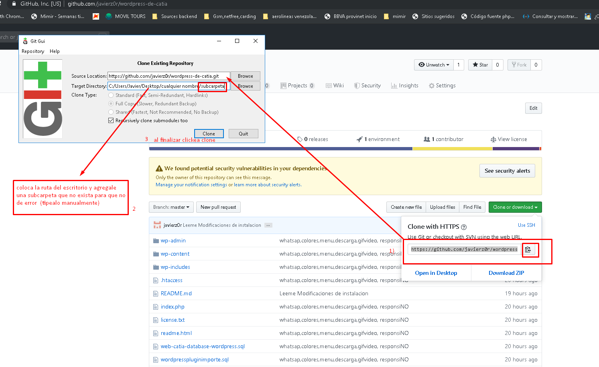
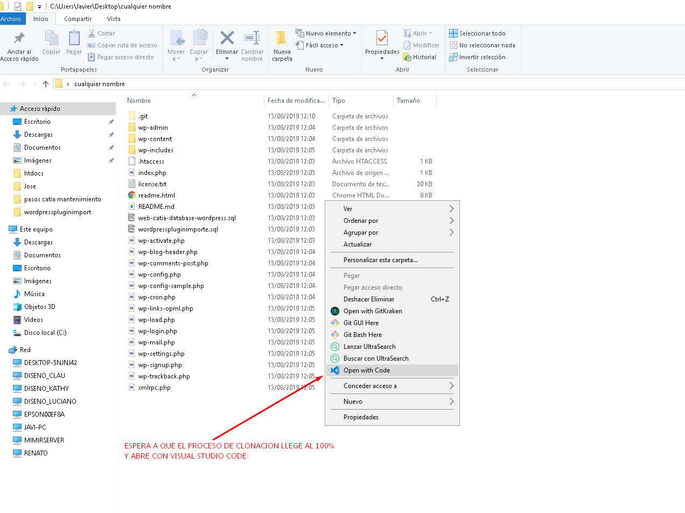

1) en caliente con el servidor:

NOTA: LA OTRA POSIBILIDAD DE MANTENIMIENTO ES REALIZARLOS EN CALIENTE, DEPURAR LAS FALLAS Y USAR
All-in-One WP Migration descargar el archivo este plugin fragmenta las descargas! y evita errores ftp bajada.
instalarlo en un wordpess local.
comprimir la carpeta del proyecto y subir el comprimido a un drive seguro.

2) por el repositorio:
el repositorio del wordpress de l2 catia

La idea con este repositorio, es que se pueda clonar, editar y subir al hosting pero manteniendo los archivos siempre a salvo en un repositorio de este git:
1) instalar xampp
2) clonar el repositorio en c:/xampp/htdocs/wordpresspluginimport
3) ir a localhost/phpmyadmin desde el explorador y colocarle una base de datos llamada wordpresspluginimporte.
4) importar el archivo sql del root del repositorio llamado wordpresspluginimporte.sql
5) si te dice error al conectar con la base de datos, mejora el archivo wp-config.php

COMO SUBIR

1) CLONAR EL REPOSITORIO CON HERRAMIENTRAS DE GIT SOFTWARE

2) SUBIR  A HTDOCS ( ALGUNOS HOSTING NO PERMITEN SUBIR FUERA DE ESTE FOLDER) LA ULTIMA VERSION CON FILEZILLA O OTRO SOFTWARE DE ADMINISTRACION FTP.
APUNTAR A LA DB ACTUAL DEL ULTIMO WORDPRESS DE CATIA ONLINE 
